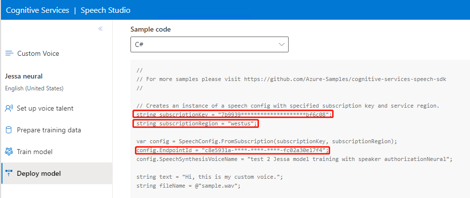

# How to suspend / resume endpoint via REST API

The endpoint Suspend and Resume functions allow you to flexibly control the endpoint hosting status and save the hosting costs. The charging will stop once the endpoint is suspended, meanwhile it can’t be used to synthesize speech until you resume it successfully.

> [!NOTE]
> The Suspend or Resume operation will take a while to complete, the Suspend time should be short and the Resume time should be similar to the deployment time.

This topic will show you how to suspend or resume a Custom Voice endpoint via REST API.

> [!Tip]
> The endpoint Suspend and Resume functions have been supported on [Speech Studio portal](https://aka.ms/custom-voice-portal) too.

## Prerequisites

For an existing endpoint you want to suspend or resume, you will need to prepare:

- The identifier of the endpoint.

- The Azure region the endpoint is associated with.

- The subscription key the endpoint is associated with.

They can be found in the Sample code section on the endpoint details page at [Speech Studio portal](https://aka.ms/custom-voice-portal) as below:



## Suspend endpoint

Suspend the endpoint identified by the given ID, which applies to the endpoint in `Succeeded` status.

1. Follow the sample request below to call the API, and you will receive the response with `HTTP 202 Status code`.

   To replace the request parameters, refer to the [Request parameter](#request-parameter).

2. Follow the [Get endpoint](#get-endpoint) steps to track the operation progress. You can poll the get endpoint API in a loop until the status becomes `Disabled`, and the status property will change from `Succeeded` status, to `Disabling`, and finally to `Disabled`.

### Sample request

HTTP sample

```HTTP
POST api/texttospeech/v3.0/endpoints/<Endpoint_ID>/suspend HTTP/1.1
Ocp-Apim-Subscription-Key: YOUR_SUBSCRIPTION_KEY
Host: <REGION_IDENTIFIER>.customvoice.api.speech.microsoft.com
Content-Type: application/json
Content-Length: 0
```

cURL sample - Run with command-line tool in Linux (and in the Windows Subsystem for Linux).

```Console
curl -v -X POST "https://<REGION_IDENTIFIER>.customvoice.api.speech.microsoft.com/api/texttospeech/v3.0/endpoints/<Endpoint_ID>/suspend" -H "Ocp-Apim-Subscription-Key: <YOUR_SUBSCRIPTION_KEY >" -H "content-type: application/json" -H "content-length: 0"
```

### Sample response

Status code: 202 Accepted

For details, see [Response header](response-header).

## Resume endpoint

Resume the endpoint identified by the given ID, which applies to the endpoint in `Disabled` status.

1. Follow the sample request below to call the API, and you will receive the response with `HTTP 202 Status code`.

   To replace the request parameters, refer to the [Request parameter](#request-parameter).

2. Follow the [Get endpoint](#get-endpoint) steps to track the operation progress. You can poll the API in a loop until the status becomes `Succeeded` or `Disabled`, and the status property will change from `Disabled` status, to `Running`, and finally to `Succeeded` or `Disabled` if failed.

### Sample request

HTTP sample

```HTTP
POST api/texttospeech/v3.0/endpoints/<Endpoint_ID>/resume HTTP/1.1
Ocp-Apim-Subscription-Key: YOUR_SUBSCRIPTION_KEY
Host: <REGION_IDENTIFIER>.customvoice.api.speech.microsoft.com
Content-Type: application/json
Content-Length: 0
```

cURL sample - Run with command-line tool in Linux (and in the Windows Subsystem for Linux).

```Console
curl -v -X POST "https://<REGION_IDENTIFIER>.customvoice.api.speech.microsoft.com/api/texttospeech/v3.0/endpoints/<Endpoint_ID>/resume" -H "Ocp-Apim-Subscription-Key: <YOUR_SUBSCRIPTION_KEY >" -H "content-type: application/json" -H "content-length: 0"
```

### Sample response

Status code: 202 Accepted

For details, see [Response header](response-header).

## Get endpoint

Get the endpoint identified by the given ID, this API allows you to query the details of the endpoint.

1. Follow the sample request below to call the API.

   To replace the request parameters, refer to the [Request parameter](#request-parameter).

2. Check the status property in response payload to track the progress for Suspend or Resume operation.

The definition of status property:
| Status | Description |
| ------------- | ------------------------------------------------------------ |
| `NotStarted` | The endpoint is waiting for processing for Deploy, and it's not ready to synthesize speech. |
| `Running` | The endpoint is in processing state for Deploy or Resume, and it's not ready to synthesize speech. |
| `Succeeded` | The endpoint succeeded to Deploy or Resume, and it's ready to synthesize speech. |
| `Failed` | The endpoint is in processing state for Suspend. |
| `Disabling` | The endpoint is waiting for processing for Deploy, and it's not ready to synthesize speech. |
| `Disabled` | The endpoint succeeded to Suspend or failed to Resume. |

> [!Tip]
> If the status goes to `Failed` or `Disabled` for Resume, you can check the `properties.error` for the detailed error message.

### Sample request

HTTP sample

```HTTP
GET api/texttospeech/v3.0/endpoints/<Endpoint_ID> HTTP/1.1
Ocp-Apim-Subscription-Key: YOUR_SUBSCRIPTION_KEY
Host: <REGION_IDENTIFIER>.customvoice.api.speech.microsoft.com
```

cURL sample - Run with command-line tool in Linux (and in the Windows Subsystem for Linux).

```Console
curl -v -X GET "https://<REGION_IDENTIFIER>.customvoice.api.speech.microsoft.com/api/texttospeech/v3.0/endpoints/<Endpoint_ID>" -H "Ocp-Apim-Subscription-Key: <YOUR_SUBSCRIPTION_KEY >"
```

### Sample response

Status code: 200 OK

```json
{
  "model": {
    "id": "a92aa4b5-30f5-40db-820c-d2d57353de44"
  },
  "project": {
    "id": "ffc87aba-9f5f-4bfa-9923-b98186591a79"
  },
  "properties": {},
  "status": "Succeeded",
  "lastActionDateTime": "2019-01-07T11:36:07Z",
  "id": "e7ffdf12-17c7-4421-9428-a7235931a653",
  "createdDateTime": "2019-01-07T11:34:12Z",
  "locale": "en-US",
  "name": "Voice endpoint",
  "description": "Example for voice endpoint"
}
```

## Request parameter

Replace the parameters with proper data you found at [Prerequisites](#prerequisites) step.

| Name                        | In     | Required | Type   | Description                                                                    |
| --------------------------- | ------ | -------- | ------ | ------------------------------------------------------------------------------ |
| `Region`                    | Path   | `True`   | string | <REGION_IDENTIFIER> - The Azure region the endpoint is associated with.        |
| `Endpoint_ID`               | Path   | `True`   | string | <Endpoint_ID> - The identifier of the endpoint.                                |
| `Ocp-Apim-Subscription-Key` | Header | `True`   | string | <YOUR_SUBSCRIPTION_KEY > The subscription key the endpoint is associated with. |

## Response header

Status code: 202 Accepted

| Name          | Type   | Description                                                                      |
| ------------- | ------ | -------------------------------------------------------------------------------- |
| `Location`    | string | The location of the endpoint which can be used as the full URL to get endpoint . |
| `Retry-After` | string | The total seconds of recommended interval to retry to get endpoint status.       |
